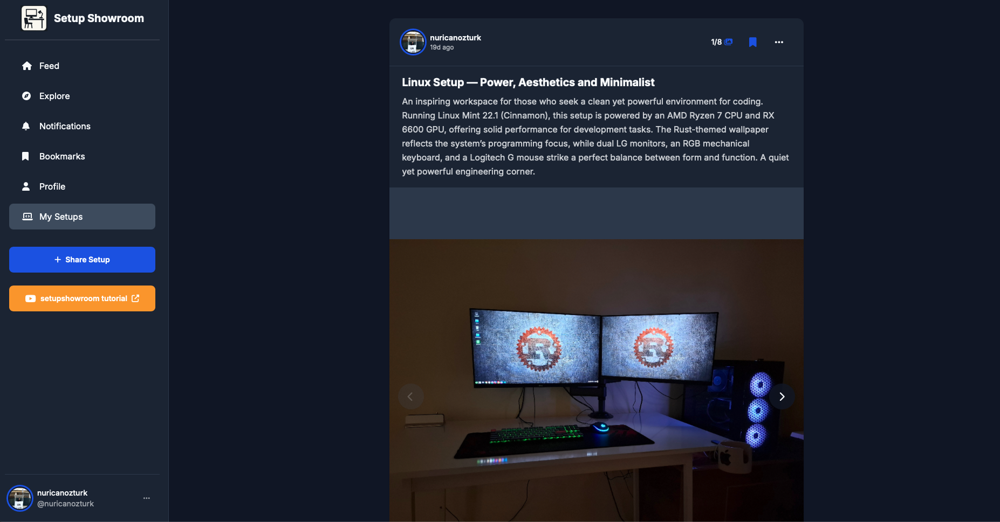
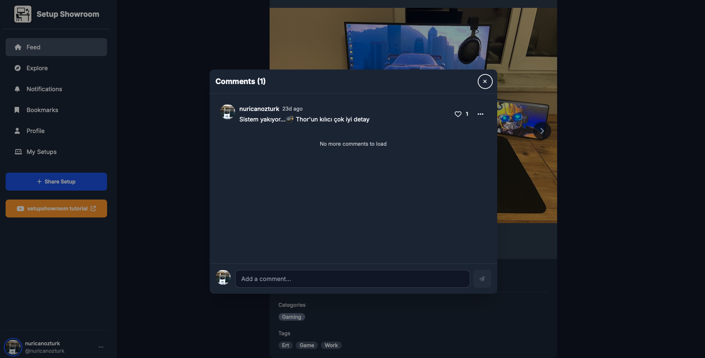
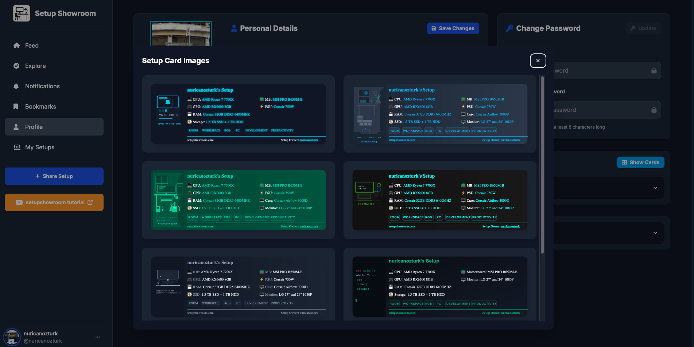
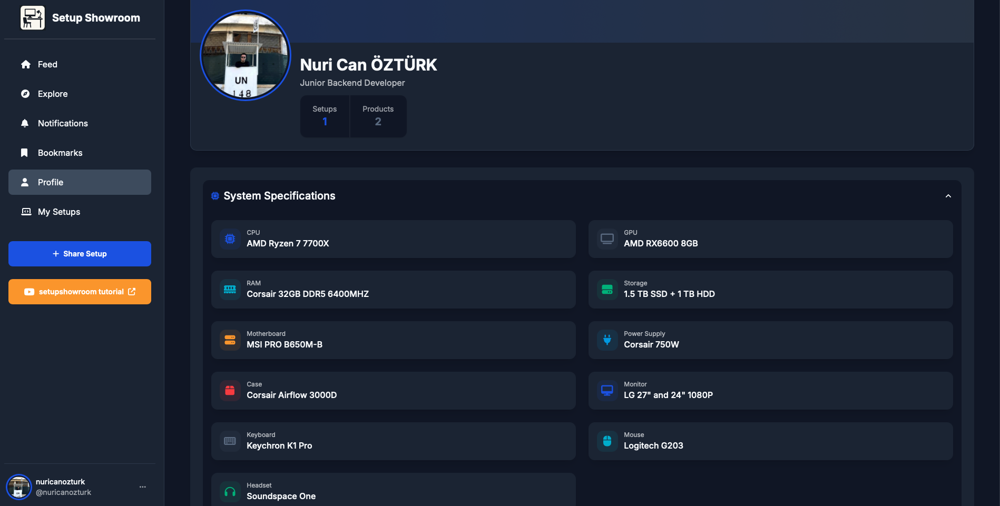
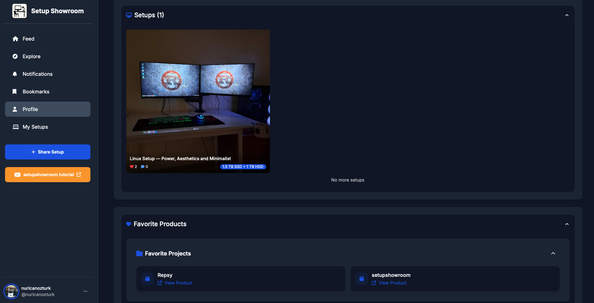
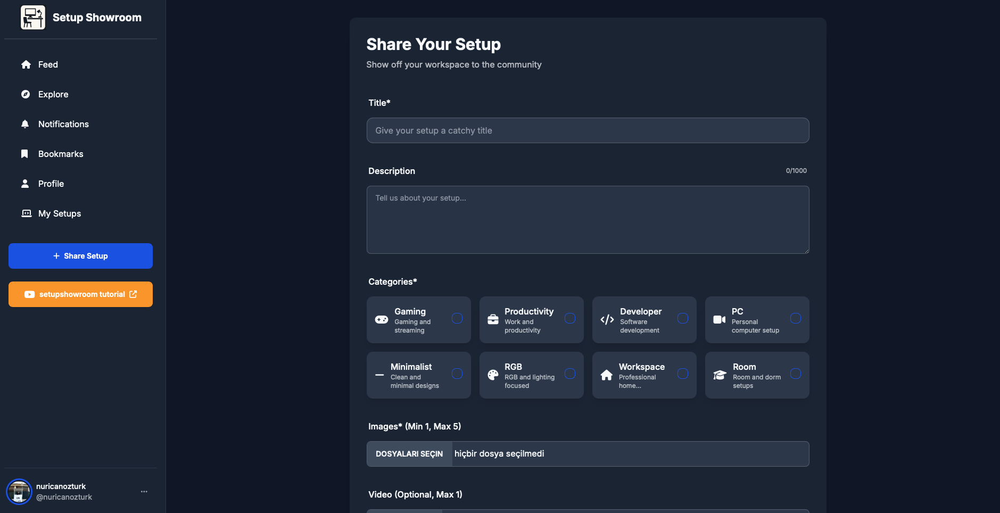

# SetupShowroom

A comprehensive social platform where users showcase their personal setups, engage with the community, and discover inspiring workspace configurations through interactive features and animated showcase cards.

## 🚀 Overview

SetupShowroom transforms the way people share and discover workspace setups by providing a feature-rich social platform. Users can upload their setup photos, interact with other setup enthusiasts, generate animated showcase cards from their profile information, and build curated lists of favorite products.

## ✨ Key Features

### Social Interaction
- **Setup Sharing**: Upload and showcase personal workspace configurations
- **Community Engagement**: Like, comment, and share setup posts
- **User Profiles**: Comprehensive profile management with setup details
- **Following System**: Connect with other setup enthusiasts

### Interactive Showcase Cards
- **Animated Cards**: Generate dynamic, animated showcase cards from profile data
- **One-Click Generation**: Access via "Show Cards" button on profile page
- **Customizable Display**: Professional presentation of setup information

### Content Management
- **Bookmarking**: Save favorite posts and setups for later reference
- **Product Lists**: Create and share curated lists of preferred setup items
- **Notification System**: Stay updated with community interactions
- **Content Reporting**: Community-driven moderation for inappropriate content

### Advanced Features
- **Real-time Notifications**: Instant updates on interactions and follows
- **Search & Discovery**: Find setups by categories, products, or users
- **Mobile Responsive**: Optimized experience across all devices
- **Content Moderation**: Users cannot share unsuitable images or videos (erotic, drugs etc)
## 🏗️ Technical Architecture

### Backend Stack
- **Java 21**: LTS version with modern language features
- **Spring Boot**: Rapid application development framework
- **Spring Security**: Comprehensive security implementation
- **Spring Data JPA**: Simplified data access layer
- **PostgreSQL**: Robust relational database system
- **Flyway**: Database migration management
- **JWT & OAuth2**: Secure authentication and authorization
- **SSE (Server Side Event)**: Notifications

### Infrastructure & DevOps
- **Kubernetes**: Container orchestration platform
- **Terraform**: Infrastructure as Code (IaC) management
- **Helm Charts**: Kubernetes package management
- **Monitoring**: Comprehensive application and infrastructure monitoring

### Storage & Media
- **Backblaze S3**: Cost-effective cloud storage for setup images
- **Minio**: Local development S3-compatible storage

### Template Engine
- **JMustache**: Logic-less templates for dynamic content rendering

## 🛠️ Core Functionality

### User Journey
1. **Registration & Profile Setup**: Users create accounts and build comprehensive profiles
2. **Setup Upload**: Share workspace photos with detailed descriptions
3. **Community Interaction**: Engage through likes, comments, and follows
4. **Card Generation**: Create animated showcase cards from profile data
5. **Content Curation**: Bookmark favorite setups and create product wishlists

### Content Moderation
- **Community Reporting**: Users can report inappropriate content
- **Automated Filtering**: Initial content screening mechanisms
- **Admin Dashboard**: Moderation tools for platform administrators

### Notification System
- **Real-time Updates**: WebSocket-based instant notifications
- **Email Notifications**: Digest emails for important activities
- **Mobile Push**: Native mobile app notification support
- **Bookmark Alerts**: Notifications for saved content updates

## 🔧 Development Standards

### Code Quality
- **Java 21 Features**: Utilizes modern Java capabilities including pattern matching and virtual threads
- **Clean Architecture**: Separation of concerns with clear layer boundaries
- **SOLID Principles**: Maintainable and extensible code structure
- **Comprehensive Testing**: Unit, integration, and end-to-end test coverage

### Security Implementation
- **OAuth2 Integration**: Third-party authentication support
- **JWT Token Management**: Secure session handling
- **Role-Based Access Control**: Granular permission system
- **Data Encryption**: Sensitive information protection

## 🚀 Deployment & Scaling

### Container Orchestration
- **Kubernetes Deployment**: Scalable microservices architecture
- **Helm Chart Management**: Simplified deployment configurations

### Infrastructure Management
- **Terraform Provisioning**: Reproducible infrastructure deployment
- **Multi-environment Support**: Development, staging, and production environments

### Monitoring & Observability
- **Application Metrics**: Performance and usage analytics
- **Log Aggregation**: Centralized logging system
- **Health Checks**: Automated service health monitoring

## 🎯 Target Audience

- **Tech Enthusiasts**: Developers, designers, and digital professionals
- **Gaming Community**: Streamers and competitive gamers
- **Remote Workers**: Home office optimization seekers
- **Creative Professionals**: Artists, photographers, and content creators

---

**SetupShowroom** represents the intersection of social networking and workspace inspiration, powered by enterprise-grade technology stack and designed for scalability and community growth.

**Live**: [setupshowroom.com](https//setupshowroom.com)

## Images

